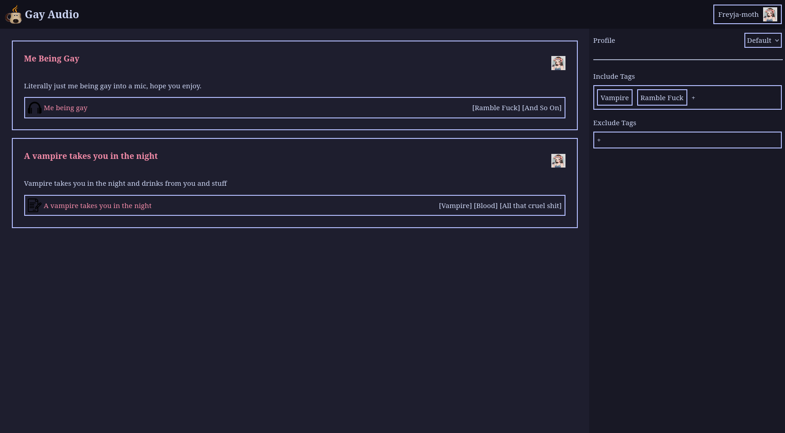
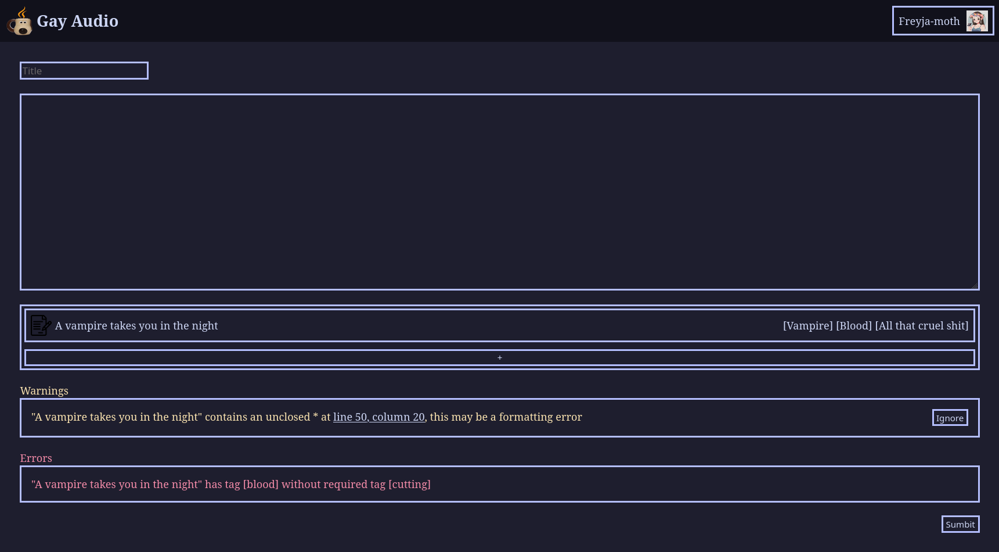
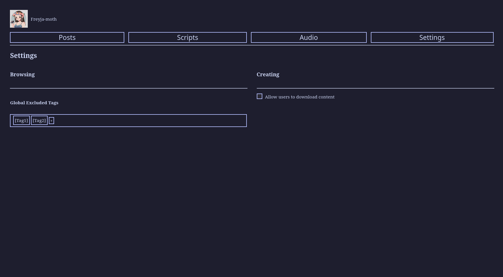
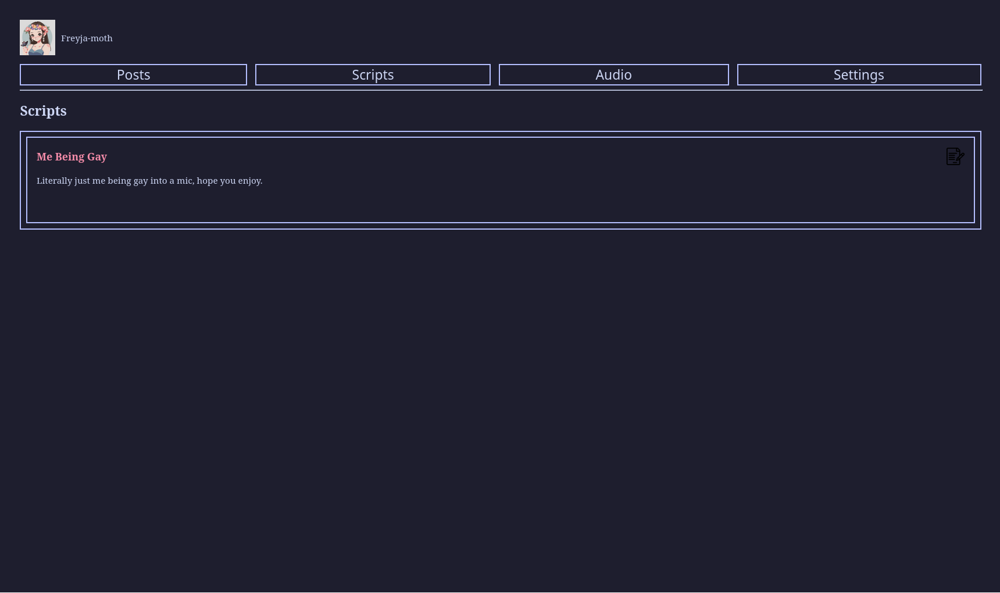
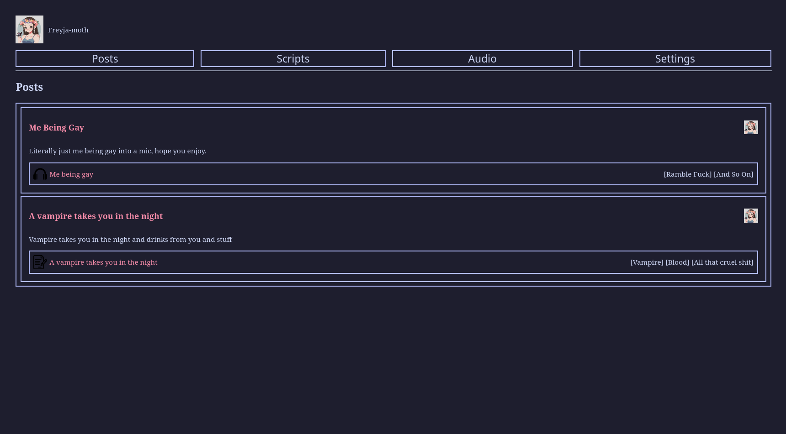

# Ui Prototypes

These are mockups for what the ui may look like using dumy data.

These are not in any fit state to be released, the css is a mess and the accesibility is quite frankly abmysmal. Expect the final product to be significantly different.

## Homescreen

The homescreen 

### TODO 

- [ ] Make tags for scripts/audio collapsable
- [ ] Add listener/speaker genders
- [ ] Add more filter options

## Post Creation

What creators see when the post.

### TODO

- [ ] Add proper markdown settings at top
- [ ] Add save to draft

## User Accounts

What users accounts will look like

### TODO
- [ ] Add about me section

# TODO

- [ ] Orphaned page
- [ ] Script Edtior
- [ ] Audio Editor
- [ ] Moderator Pages
